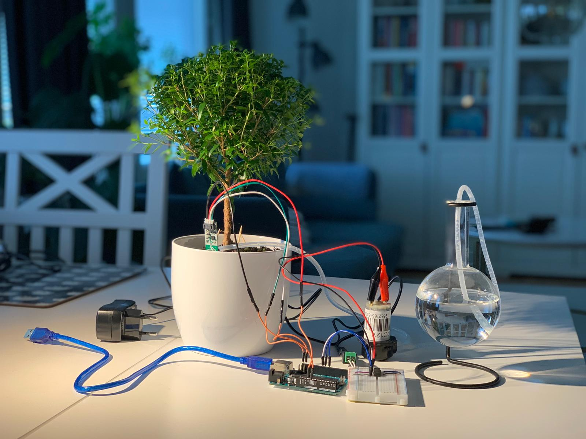
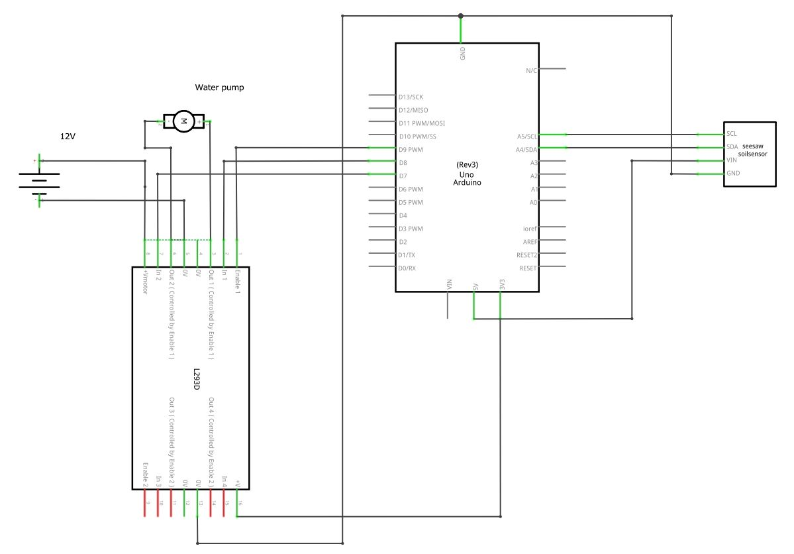

# Plant watering system
Manage capacitive soil sensor readings from a plant and water it when minimum value exceeds, from a 2 weeks school project in a Embedded systems course.

# Hardware
* Arduino UNO R3
* Adafruit STEMMA Soil Sensor - I2C Capacitive Moisture Sensor
* Adafruit Peristaltic liquid pump with Silicone tubing – 12V DC Power
* Adafruit, Dual H-Bridge Motor Driver for DC or Steppers – 600 mA – L293D

